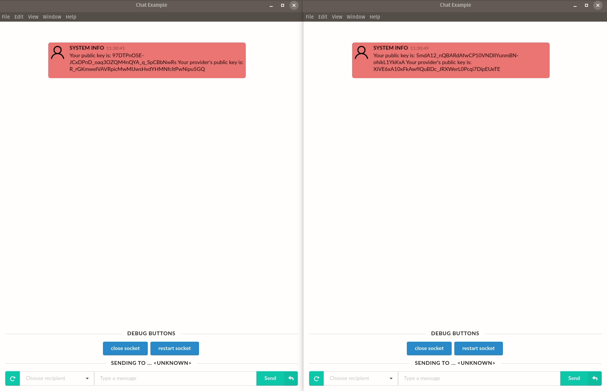

# demo-mixnet-electron-chat

**Note: don't depend on this for anything serious, it's a demo rather than a production application, with an incomplete cryptographic implementation.**

This is a simple chat application. You can start a few clients, and chat back and forth. Chat traffic is encrypted and routed through the [nym-mixnet](https://github.com/nymtech/nym-mixnet).

## Requirements

* Go 1.12 or later
* Recent version of Node (tested to be working with v10.17.0)
* yarn package manager (or equivalent, such as npm)

## Building it

**Note: The application was only tested to be building and running on Linux.**

From the top-level directory, `yarn install --production=false` will download all dependencies required to build the application. `yarn dist` will build a single binary that can be moved around. If you prefer to run everything locally,  `yarn build` will build the application without packaging it.

## Running it

If you packaged the app, starting it is as simple as running the created binary: `./build/mixnet-electron-client-0.0.1.AppImage`. Otherwise if you used `yarn build`, you need to call `yarn start` now.

By default it will look for the `savedID.nymchat` file in the directory from which the application was run. If it exists, the specified id will be used to lookup public/private mixnet keypairs on your local machine.

Otherwise, a random id will be generated and corresponding public/private keypairs will be created and stored on your local machine. If you want to see those, have a look in `~/.loopix` - exact locations are noted upon keypair generation. The new `savedID.nymchat` will also be created.

**Please do note, you should not start more than a single instance from the same directory unless you know exactly what you're doing.**

### Optional arguments

When the app is started using the standalone binary, it can accept two optional arguments to adjust its default behaviour.

The first arguments allows you to supersede the loopix client id being used. However, it is then your responsibility to ensure the appropriate keys and configuration file exist in `~/.loopix`

The second argument, which is expected to be a number between 1024 and 49151 will change the port used for websocket communcation of the electron application with the mixnet client. By default a random, open port is chosen.

So for example, to run it with hardcoded id `Alice` on port `9001`, you would call it with: `./build/mixnet-electron-client-0.0.1.AppImage Alice 9001`.

### Chat session

When the application starts, you will be shown with your own public key and the option to choose recipient using the dropdown menu at the bottom. If you started two instances of the application (from separate directories), use the key of the other instance as the recipient.

Once you have each others' public keys selected, you can chat back and forth. Traffic is sent through the mixnet, and briefly stored on a packet storage node (which holds traffic for offline clients). The chat client then retrieves packets and displays messages.

A simple chat session will look something like this:

Although the application looks simple, there's actually quite a bit going on.

Nym mixnet nodes report their presence every few seconds to the Nym directory server, which provides information about Nym mixnet IP addresses and public keys.

When started, this chat client connects in background to the Nym directory, and retrieves the current network topology from [https://directory.nymtech.net/api/presence/topology](https://directory.nymtech.net/api/presence/topology).

Once it knows what mixnet nodes exist, the client uses the IP addresses and public keys of Nym mixnet nodes to generate per-packet shared keys for doing [Sphinx](https://cypherpunks.ca/~iang/pubs/Sphinx_Oakland09.pdf) packet encryption. The client immediately begins encrypting dummy traffic, sending loop cover traffic through the mixnet. Loop traffic then loops back to the client, providing cover traffic for both sending and receiving.

When you type your message into the chat console and hit "enter", the chat client sends your real message instead of a loop cover packet.

## Viewing network traffic

You can view traffic moving across the mixnet by looking at https://dashboard.nymtech.net/.

On the right hand side, you can see packets sent and received in a 1-second period:

